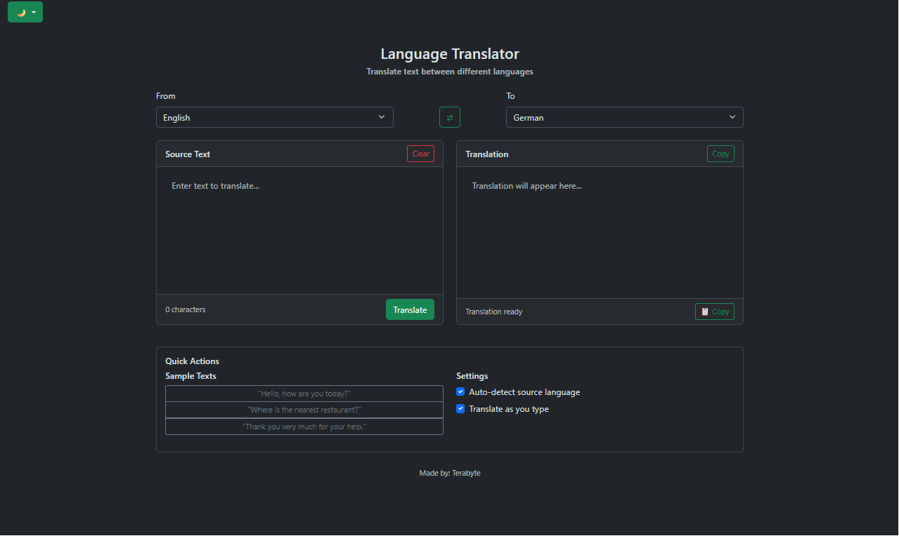
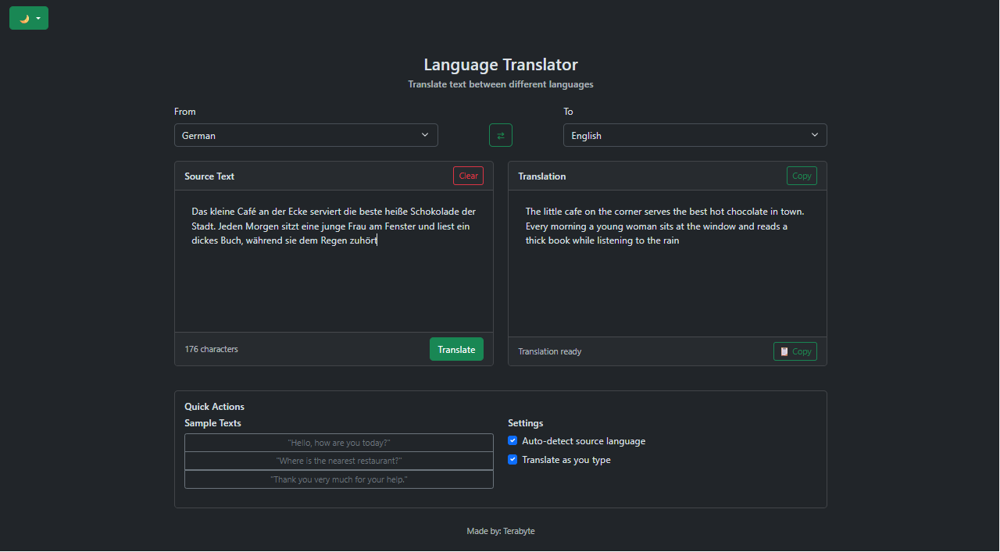
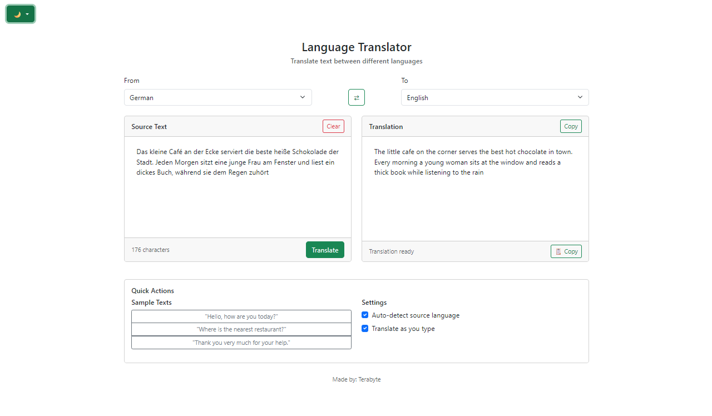

# 🌐 Web Translator

> A clean, responsive translation web application built to strengthen Python backend development skills and practice secure API integration.

**🔗 Live Demo:** https://ter4by2e.eu.pythonanywhere.com/  
**📅 Built:** Summer 2026

---

## 📝 About

**Web Translator** is a Flask-based web application that translates text between languages through a secure server-side API broker.

Rather than exposing third-party API credentials to the browser, all translation requests are routed through a Python backend before being forwarded to the external service. The project was built to strengthen my understanding of backend architecture, asynchronous client-server communication, and secure configuration management.

  

---

## 🛠️ Tech Stack

- **Backend:** `Flask` (Python)
- **Frontend:** `HTML5`, `Bootstrap 5`, `Vanilla JavaScript`
- **Client Communication:** `Fetch API`
- **Translation API:** `RapidAPI`
- **HTTP Client:** `requests`
- **Configuration:** `python-dotenv`
- **Hosting:** `PythonAnywhere`

---

## ✨ Features

### 🌐 Automatic Language Detection

When the source language is set to **Auto Detect**, the backend forwards the request to the translation service, allowing it to identify the input language automatically.

### ⚡ Asynchronous Translation

The frontend communicates with the Flask backend using the Fetch API and `async`/`await`, allowing translations to happen without refreshing the page while displaying live status messages such as **"Detecting language..."** and **"Translating..."**.

  

### 🎨 Theme Switching

Users can instantly switch between **Light**, **Dark**, and **System** themes. Bootstrap's `data-bs-theme` attribute is updated dynamically without interrupting the current interface state.

  

### ♻️ Reusable Language Templates

Both language dropdowns are populated from a shared Jinja template (`languages.html`), avoiding duplicated markup and making future maintenance simpler.

---

## 🔒 Security & Technical Reflection

### Credential Management

- RapidAPI credentials are loaded securely through environment variables using `python-dotenv`.
- Sensitive configuration values remain outside the source code and are excluded from version control through `.gitignore`.
- When deployed on PythonAnywhere, secrets are configured through the hosting environment rather than being hardcoded into the application.

### Backend API Brokerage

Instead of communicating directly with RapidAPI, the browser sends requests to the Flask backend. The backend attaches the required authentication headers before forwarding the request, ensuring API credentials are never exposed to clients.

### Error Handling

Outbound requests use `response.raise_for_status()` together with a five-second timeout to detect failures cleanly rather than allowing requests to hang indefinitely.

### Stateless Request Processing

Each translation request is processed independently and is not persisted after the response is returned. The backend receives the text, requests a translation from the external service, and immediately returns the result to the client.

---

## 🧠 What I Learned

Building this project gave me practical experience with several backend development concepts:

- Designing Flask routes that act as secure intermediaries between clients and external APIs.
- Working with JSON payloads using `request.get_json()` and `jsonify()` to exchange structured data between JavaScript and Python.
- Improving HTTP error handling by combining `response.raise_for_status()` with explicit timeout values.
- Separating configuration from application logic by loading sensitive values from environment variables instead of embedding them in source code.
- Building asynchronous user interfaces using the Fetch API and `async`/`await` while keeping the page responsive.
- Reducing duplicated template code by reusing shared Jinja components across multiple interface elements.

---

## 🚀 Future Improvements

- [ ] Implement rate limiting on the `/translate` endpoint to reduce abuse and protect API quotas.
- [ ] Add server-side input validation and character limits before forwarding requests to the translation service.
- [ ] Introduce translation caching to reduce duplicate API calls and improve response times.
- [ ] Store recent translations locally for easier access and a better user experience.
- [ ] Expand automated testing for backend routes and API failure scenarios.

